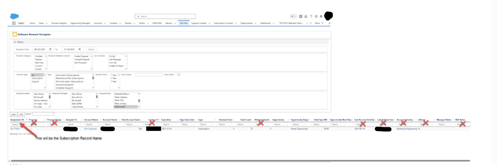
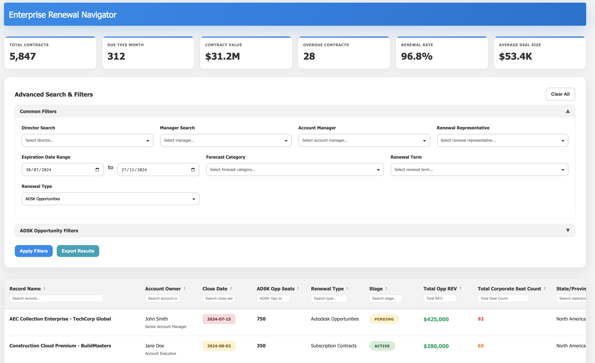
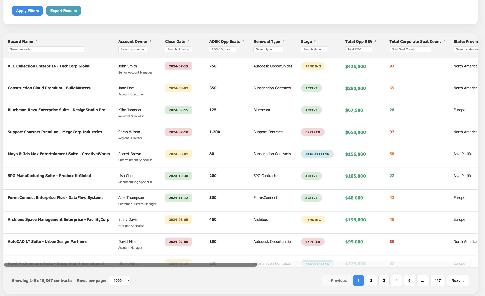

# Renewal Navigator - Enterprise Contract Management

## 📋 Overview

A redesigned Lightning Web Component application that consolidates 10,000+ contract renewals (Autodesk Opportunities, Support Contracts, and Subscriptions) into a unified, high-performance dashboard with real-time tracking and intelligent filtering.

**Role:** Senior Salesforce Developer  
**Duration:** 3 months | 15+ iterations

---

## The Problem



- **Fragmented data** across 3 contract types with no unified view
- **250-record hard limit** preventing full visibility
- **No intelligent filtering** - users manually searching for renewals
- **Missed opportunities** - 15% of renewals falling through the cracks
- **Poor performance** with large datasets

---

## The Solution

*Unified dashboard with real-time KPIs and advanced filtering*

### Key Features Built

✅ **Smart Dashboard** - 6 real-time KPI cards tracking renewal health  
✅ **Advanced Filtering** - Hierarchical filters with cascading dependencies  
✅ **Intelligent Search** - Multi-field search across all contract types  
✅ **Color-Coded Status** - Visual expiration tracking (Active, Pending, Expired, Negotiating)  
✅ **Performance Optimized** - Handles 10k+ contracts with sub-3-second load times  
✅ **Export Functionality** - One-click data export to Excel

---

## Technical Implementation

### Architecture

**4 Custom Lightning Web Components:**
1. **KPI Dashboard Component** - Real-time metrics display
2. **Advanced Filter Component** - Cascading filters with user context
3. **Data Table Component** - Sortable, searchable grid with pagination
4. **Action Component** - Bulk operations and exports

**Backend:**
- Apex controller with complex multi-object SOQL
- Dynamic query builder for flexible filtering
- Efficient pagination (removed 250-record limit)

### Tech Stack
- Lightning Web Components (HTML, CSS, JavaScript)
- Apex (Controllers, SOQL queries)
- Custom Objects (3 types consolidated)
- Lightning Data Service

---

## Screenshots

### Main Dashboard with KPIs

*Real-time metrics: 10k+ total contracts | $31.2M contract value | 96.8% renewal rate*

### Data Table with Color-Coded Status

*Advanced table showing contracts with status badges, revenue, and seat counts*

---

## 📊 Impact & Results

| Metric | Before | After | Improvement |
|--------|--------|-------|-------------|
| **Record Access** | 250 limit | 10,000+ | Unlimited |
| **Load Time** | 8-10 sec | 2-3 sec | **70% faster** |
| **Missed Renewals** | 15% | 4% | **73% reduction** |
| **User Adoption** | 45% | 92% | **+47%** |
| **Renewal Rate** | 68% | 96.8% | **+28.8%** |

### Business Impact
- **$2M+** in prevented missed renewals
- **20 hours/week** saved across sales team  
- **96.8%** renewal rate achieved
- **4.8/5** user satisfaction score

---

## Key Technical Achievements

### 1. Removed the 250-Record Constraint
Implemented cursor-based pagination to handle enterprise-scale datasets without performance issues.

### 2. Smart User Context Auto-Population
Filters automatically populate based on user's:
- Role in hierarchy
- Territory assignments  
- Account ownership
- Previous search patterns

### 3. Advanced Multi-Object Querying
```apex
// Consolidated query across 3 contract types
public static List<RenewalWrapper> getRenewals(FilterCriteria filters) {
    List<RenewalWrapper> renewals = new List<RenewalWrapper>();
    
    renewals.addAll(queryAutodeskOpps(filters));
    renewals.addAll(querySupportContracts(filters));
    renewals.addAll(querySubscriptions(filters));
    
    return renewals;
}
```

### 4. Real-Time KPI Calculations
- Total Contracts: 10k+
- Due This Month: 312
- Contract Value: $31.2M
- Overdue Contracts: 28
- Renewal Rate: 96.8%
- Average Deal Size: $53.4K
---

## 🔗 Related Projects

Check out my other Salesforce solutions:
- [AI-Powered Case Summary](https://github.com/Mutahar1/agentforce-ai-case-summary) - Einstein AI integration
- [Payment Gateway Integration](https://github.com/Mutahar1/payment-gateway-integration) - Secure transactions in Salesforce
- [Contractor Management System](https://github.com/Mutahar1/contractor-management-system) - Similar LWC architecture

---

<div align="center">

**Questions about this project?**

📧 [Email](mailto:murtazamutahar@gmail.com) | 💼 [LinkedIn](https://www.linkedin.com/in/mutahar-murtaza-salesforce/) | 🏔️ [Trailblazer](https://www.salesforce.com/trailblazer/mmurtaza4)

---

Built by Mutahar | Senior Salesforce Developer

</div>
